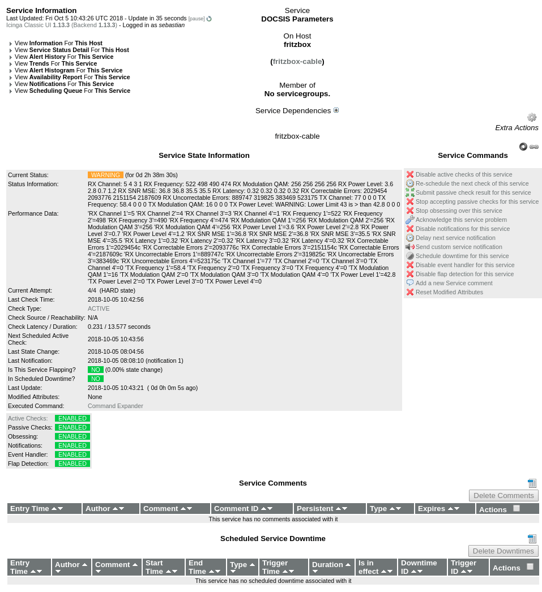
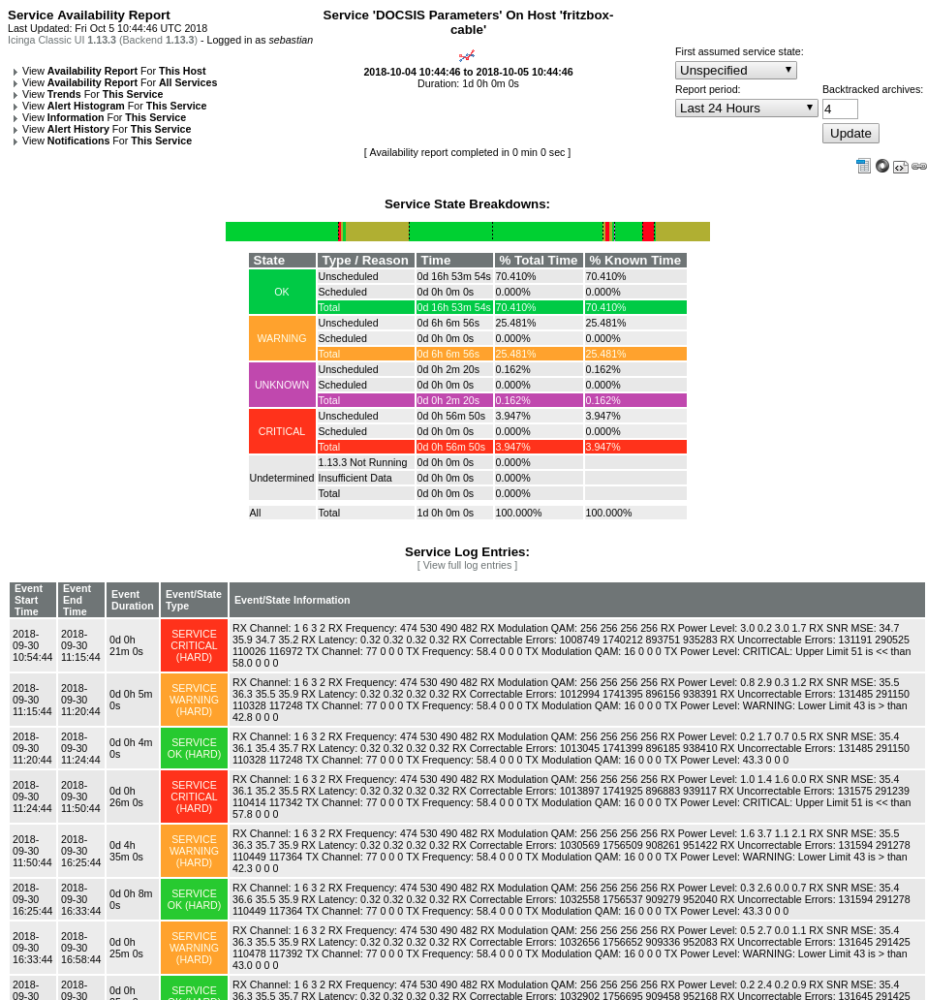
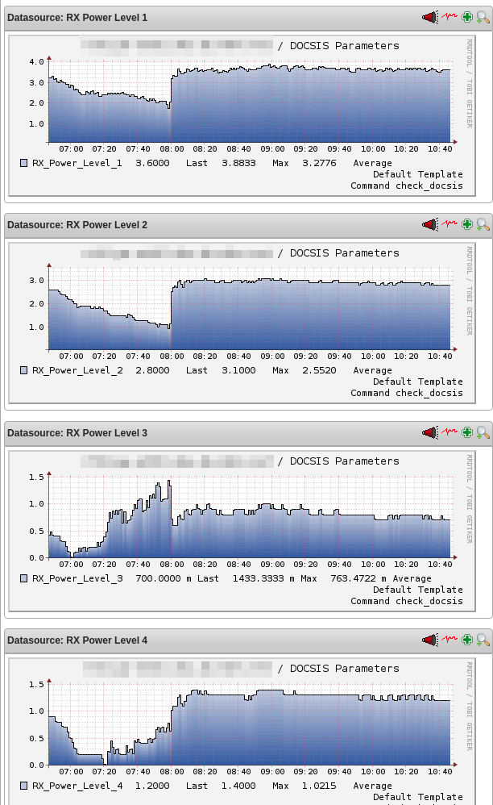

# monitoring-plugins_check_fritzbox_docsis_parameters

Icinga/Nagios Check for DOCSIS Parameters on a Fritzbox Cable
Modem/Router. Perfdata is enabled, so given that you are using
something like PNP4Nagios, nice graphs will be drawn.

Requires curl, html2text, bc. Rename config.dist.sh to config.sh and
adjust configuration to suit your needs.

Icinga config could look like this:

    define command{
        command_name check_docsis
        command_line /path/to/fritzbox.sh
    }

    define service {
        use                              generic-service
        host                             fritzbox-cable
        service_description              DOCSIS Parameters
        check_command                    check_docsis
    }

